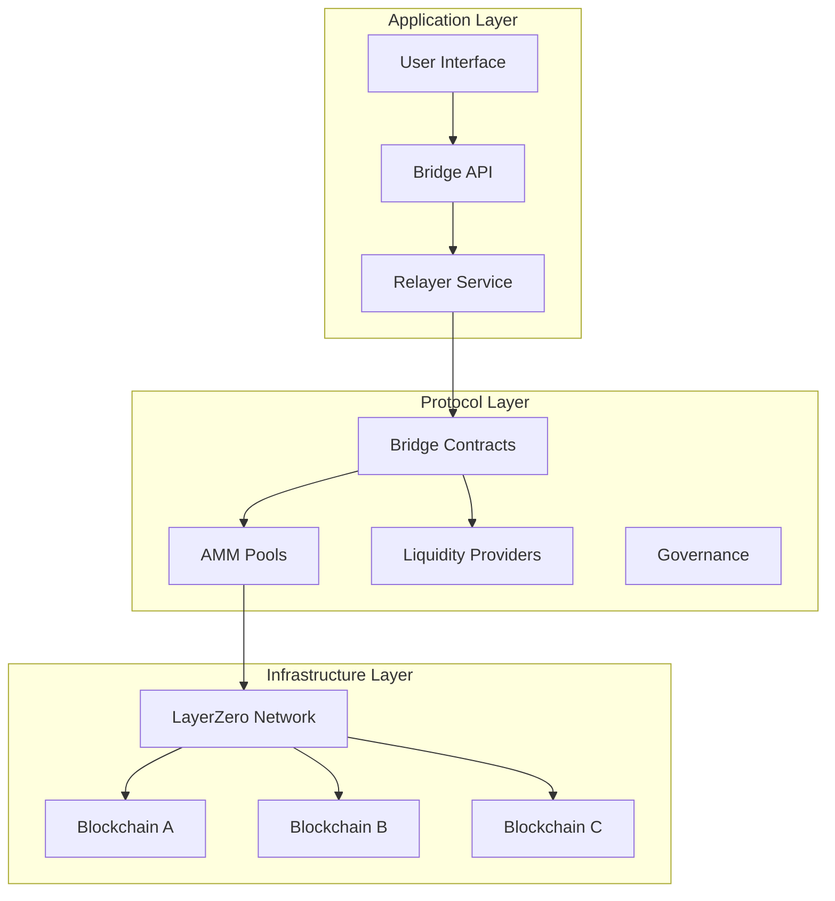
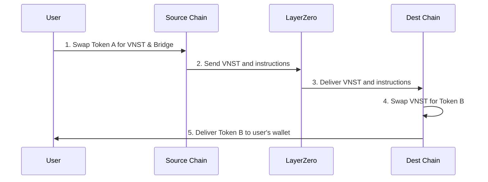
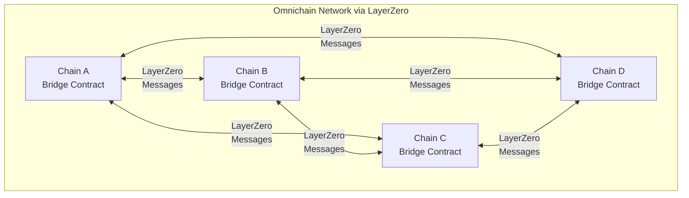
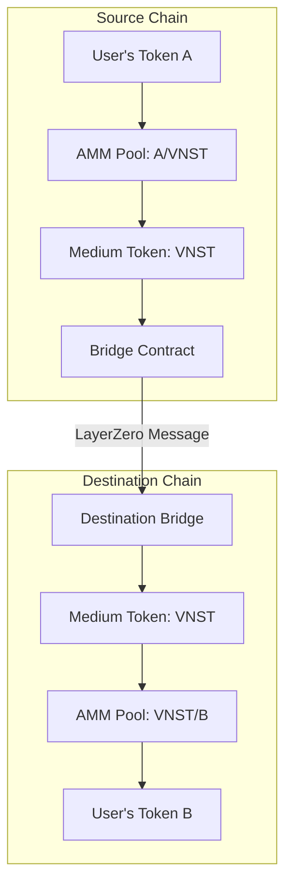
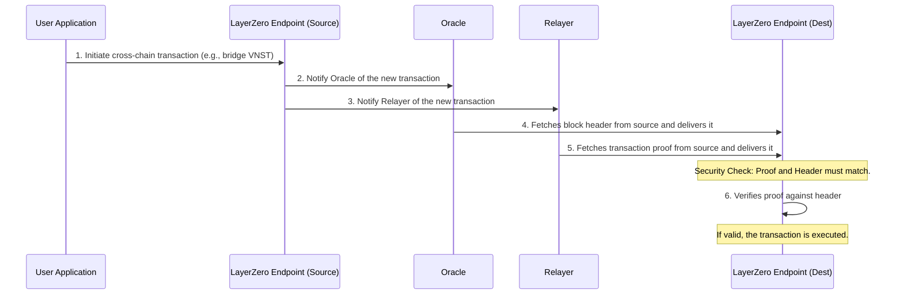
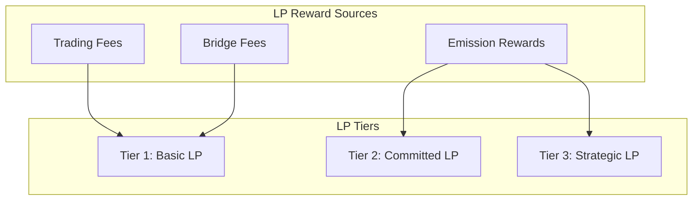
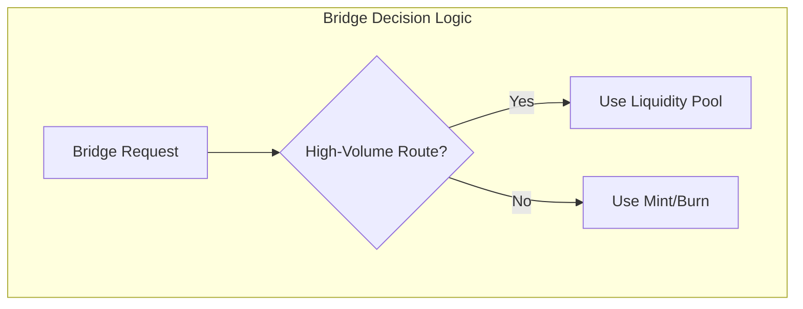
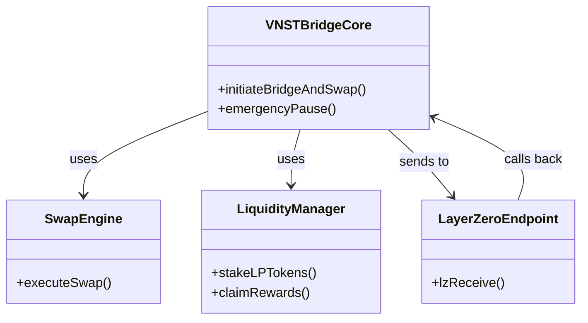
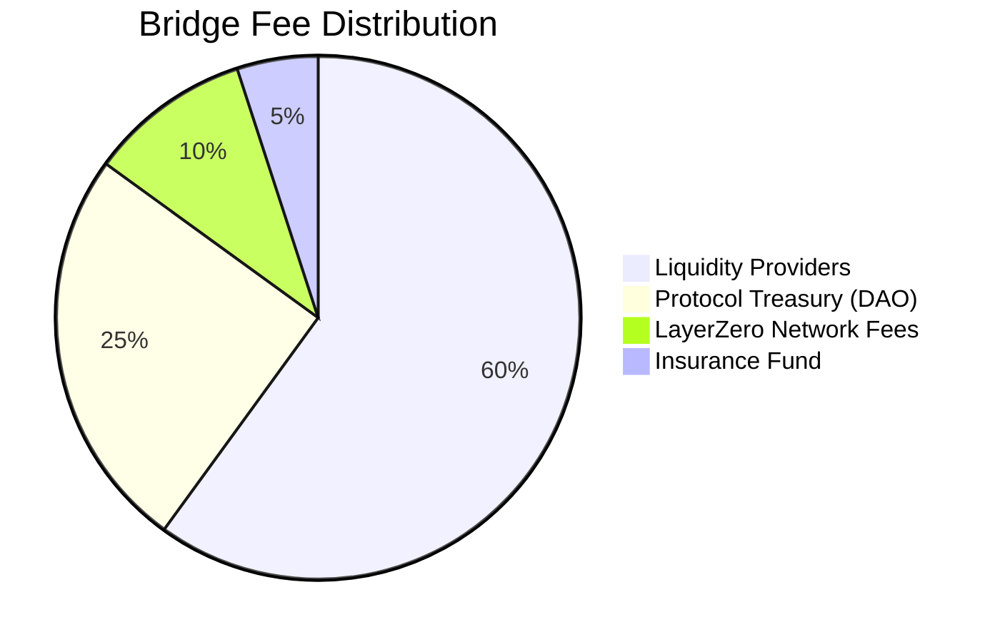

# VNST Cross-Chain Bridge & Swap Protocol
## Technical Architecture Documentation

### Version 1.0
### Last Updated: June 28, 2025

---

## Table of Contents

1. [Executive Summary](#executive-summary)
2. [System Architecture Overview](#system-architecture-overview)
3. [Core Components](#core-components)
4. [Token Economics & Medium Token Strategy](#token-economics--medium-token-strategy)
5. [LayerZero Integration](#layerzero-integration)
6. [Automated Market Maker (AMM) Integration](#automated-market-maker-amm-integration)
7. [Liquidity Provider System](#liquidity-provider-system)
8. [Bridge Mechanisms](#bridge-mechanisms)
9. [Smart Contract Architecture](#smart-contract-architecture)
10. [Security Considerations](#security-considerations)
11. [Deployment Strategy](#deployment-strategy)
12. [Economic Model](#economic-model)

---

## Executive Summary

The VNST Cross-Chain Bridge & Swap Protocol is a sophisticated multi-chain infrastructure that enables seamless token bridging and swapping across different blockchain networks. The protocol employs VNST (Vietnamese Stablecoin) as a universal medium token, facilitating cross-chain transactions through a combination of Automated Market Makers (AMMs), liquidity pools, and LayerZero's cross-chain messaging infrastructure.

### Key Features
- **Universal Medium Token**: VNST serves as the intermediary asset for all cross-chain swaps, simplifying liquidity.
- **Hybrid Bridge Architecture**: Combines capital-efficient mint/burn with seamless liquidity pool transfers.
- **Integrated Swapping**: Native DEX functionality on each supported chain for a one-click user experience.
- **Incentivized Liquidity**: A robust economic model to reward community liquidity providers.
- **LayerZero Security**: Leverages a battle-tested, highly secure cross-chain messaging protocol `LayerZero`.

---

## System Architecture Overview

The protocol operates on a three-layer architecture, separating the user-facing applications, the core on-chain protocol logic, and the underlying blockchain infrastructure.

### High-Level Transaction Flow

A user performs a cross-chain swap in a single transaction. The protocol abstracts the complexity of swapping, bridging, and swapping again.

---

## Core Components

### 1. The Medium Token: VNST (Intermediary Token To Support Cross-chain Swapping)

The protocol's foundation is the use of a single, stable medium token, **VNST**, for all cross-chain operations. This design choice is strategic:
- **Simplified Liquidity**: Instead of needing pools for every token pair (e.g., A-B, A-C, B-C), we only need pools for each token against VNST (A-VNST, B-VNST, C-VNST). This dramatically reduces the amount of liquidity required.
- **Stable Value**: Using a stablecoin minimizes the price volatility risk for users during the bridging process.

To function across multiple chains, VNST exists in two forms:
- **Native VNST**: The official VNST token on its origin chain (e.g., Ethereum).
- **Lotus VNST (loVNST)**: A synthetic, platform-branded version of VNST deployed on other chains. This token is created using a strict 1:1 backing mechanism, where each `loVNST` is backed by one native VNST locked in the bridge contract on the origin chain.

### 2. Cross-Chain State Consistency

The protocol does not attempt to replicate the entire state across all chains. Instead, it uses LayerZero messages to pass instructions and validate state changes. The core principle is that the total supply of circulating `loVNST` across all chains can never exceed the total amount of native VNST locked in the main bridge contract. This ensures the system remains solvent and fully backed at all times.

LayerZero enables omnichain functionality by allowing each chain to communicate with every other supported chain through secure message passing. This creates a network where state changes can be propagated and validated across multiple blockchains simultaneously.

---

## Token Economics & Medium Token Strategy

### The Bridge & Swap Flow

The protocol's core innovation is combining a swap and a bridge into a single, seamless user action. This is achieved through a three-step process managed by the smart contracts:

1.  **Source Swap**: On the source chain, the user's input token (e.g., USDC) is swapped for VNST through an integrated AMM pool.
2.  **Cross-Chain Bridge**: The acquired VNST is then bridged to the destination chain using one of our two bridge mechanisms (see below).
3.  **Destination Swap**: On the destination chain, the received VNST is swapped for the user's desired output token (e.g., `loETH`).

This model decouples the swapping and bridging logic, making the system highly modular. We can integrate with any AMM and add support for new tokens simply by creating a new VNST pair pool.

---

## LayerZero Integration

### Security Model

The protocol's cross-chain security relies on LayerZero. LayerZero's security comes from the separation of duties between two independent off-chain entities: the **Oracle** and the **Relayer**. 
- The Oracle forwards a block header from the source chain to the destination chain.
- The Relayer forwards the proof of the transaction itself.

The transaction is only considered valid if both the block header from the Oracle and the transaction proof from the Relayer match. This makes it extremely difficult for any single party to maliciously forge a cross-chain message.

### Omnichain Token Standards & Bridging Mechanisms

To handle cross-chain transfers efficiently and scalably, the protocol uses two distinct LayerZero-based mechanisms: one for our native medium token (VNST) and another for all other tokens.

#### 1. OFT Standard for the Medium Token (VNST)

For our core medium token, `VNST`, we use LayerZero's **Omnichain Fungible Token (OFT)** standard. This makes `VNST` itself an inherently cross-chain asset.

-   **ProxyOFT (for Native VNST)**: Deployed on the origin chain, this contract locks native `VNST` when bridging out.
-   **OFT (for Lotus VNST - `loVNST`)**: Deployed on all other chains, this contract mints and burns `loVNST` based on messages from the ProxyOFT. It *is* the `loVNST` token.

This approach is perfect for our core utility token, as it provides the tightest integration and makes `VNST`'s omnichain behavior standardized and clean.

#### 2. Universal Bridge for All Other Tokens

Deploying an OFT contract for every single token we wish to support is not scalable. To avoid this overhead, we use a more powerful and generic approach for all other assets (e.g., USDC, WETH, etc.).

-   **Universal `Bridge` Contract**: A single, robust `Bridge` contract is deployed on each chain. This contract acts as a universal handler for any arbitrary token.
-   **Generic Messaging (Lock/Mint & Burn/Release)**: When a user wants to bridge USDC, for example:
    1.  The user deposits USDC into the `Bridge` contract on the source chain.
    2.  The `Bridge` contract locks the USDC and sends a generic LayerZero message to the destination chain's `Bridge` contract.
    3.  The destination `Bridge` receives the message and mints an equivalent amount of `loUSDC` to the user.

This generic message-passing architecture allows us to support a virtually unlimited number of tokens without deploying new infrastructure for each one, making the protocol highly scalable and easy to maintain.

## Automated Market Maker (AMM) Integration

To facilitate the swap part of the "bridge and swap," the protocol integrates with AMMs on each chain. We have chosen to be compatible with the **Uniswap V2** model for its simplicity, widespread adoption, and deep liquidity.

-   **Pools**: On each chain, we will encourage and incentivize the creation of liquidity pools for major tokens against `loVNST`. For example, `loETH/loVNST`, `USDC/loVNST`, etc.
-   **Swap Routing**: The bridge contract will interact directly with the Uniswap V2-compatible router to execute swaps. It will calculate the optimal path to convert the user's input token to `loVNST` and vice-versa.
-   **Price Oracles**: To protect against price manipulation (e.g., via flash loans), our system will consult Time-Weighted Average Price (TWAP) oracles, which are more robust than spot prices. These oracles are a standard feature of Uniswap V2-style pools.

## Liquidity Provider System

A successful bridge requires deep liquidity. To incentivize the community to provide this liquidity in our AMM pools, we have designed a multi-layered reward system.

### LP Rewards

Liquidity Providers (LPs) who stake their LP tokens in our protocol will earn rewards from multiple sources:
-   **Trading Fees**: A portion of the standard 0.3% fee from the AMM swaps.
-   **Bridge Fees**: A percentage of the fees generated by the bridge itself.
-   **Emission Rewards**: Protocol-issued VNST tokens as a direct incentive.

### Staking Tiers & Impermanent Loss Protection

To encourage long-term, stable liquidity, we will introduce a tiered staking system. LPs who commit to locking their tokens for longer periods (e.g., 6 or 12 months) will receive boosted rewards. Furthermore, for these committed LPs, the protocol will offer a degree of **Impermanent Loss (IL) Protection**. This is a mechanism where the protocol partially compensates LPs if the value of their deposited assets decreases compared to simply holding them, a common risk in liquidity provision.

---

## Bridge Mechanisms

The protocol uses a **Hybrid Bridge Architecture** to optimize for both capital efficiency and user experience. The system dynamically chooses between two mechanisms based on the route's liquidity and volume.

1.  **Mint/Burn Mechanism (Default)**
    -   **How it works**: Locks native VNST on the source chain and mints an equivalent amount of `loVNST` on the destination chain.
    -   **Pros**: Infinitely scalable and requires no pre-seeded liquidity on the destination chain. Highly capital-efficient.
    -   **Cons**: The user receives a platform-specific wrapped token (`loVNST`), which may require an extra step to be used in some dApps that haven't integrated it yet.

2.  **Liquidity Pool Mechanism (For High-Volume Routes)**
    -   **How it works**: The bridge maintains a pool of native VNST on both the source and destination chains. When a user bridges, tokens are deposited into the source pool and withdrawn from the destination pool.
    -   **Pros**: The user receives the native token on the destination chain, which is a better user experience.
    -   **Cons**: Requires significant upfront capital to seed the liquidity pools on both ends.

---

## Smart Contract Architecture

The contract architecture is designed to be modular and upgradable.

-   **Separation of Concerns**: The logic is split into distinct contracts. For example, a `SwapEngine` handles all AMM interactions, a `LiquidityManager` handles LP staking, and the main `Bridge` contract orchestrates the overall flow. This makes the system easier to audit and upgrade.
-   **Upgradability**: The core contracts will use the UUPS (Universal Upgradeable Proxy Standard) pattern. This allows the contract logic to be upgraded without requiring users to migrate their funds, ensuring smooth evolution of the protocol.
-   **Security**: All contracts will inherit standard security modules from providers like OpenZeppelin, including re-entrancy guards, pausable functionality, and robust access control.

---

## Security Considerations

Security is paramount. Our strategy is multi-layered:

-   **Smart Contract Security**: The codebase will undergo multiple independent audits. We will also run a public bug bounty program.
-   **LayerZero Security**: We inherit the security of the underlying LayerZero protocol.
-   **Economic Security**: The protocol includes circuit breakers to halt activity in case of unusual volume or price movements. For example, there will be limits on the maximum transaction size and the total value that can be bridged in a 24-hour period.
-   **Operational Security**: Protocol administration functions will be controlled by a multi-signature wallet with a time-lock. This prevents any single person from making critical changes and provides time for the community to react to proposed upgrades.

---

## Deployment Strategy

The protocol will be rolled out in phases to ensure stability and security.

1.  **Testnet Phase**: Initial deployment on testnets (e.g., Ethereum Sepolia, Base Sepolia) for public testing and feedback.
2.  **Mainnet Launch (Guarded)**: Launch on Ethereum and Base with conservative limits on bridge volume. The initial liquidity will be seeded by the team.
3.  **Expansion Phase**: Gradually add support for more chains (Polygon, Arbitrum, etc.) and increase the volume limits as the protocol proves its stability.
4.  **Decentralization**: Transition control of the protocol parameters and treasury to a community-governed DAO.

---

## Economic Model

### Fee Structure

The protocol will generate revenue through a small fee on each bridge transaction. This fee will be distributed to sustain the ecosystem:

### VNST Token Utility

The native VNST token is central to the protocol's economic model, with several key utilities:
-   **Governance**: VNST holders can vote on protocol upgrades and parameter changes.
-   **Staking**: Used for emission rewards to incentivize liquidity providers.
-   **Fee Discounts**: Staking or holding VNST may provide users with reduced bridge fees.
-   **Insurance Fund**: A portion of the treasury's VNST will back an insurance fund to cover potential losses in an emergency scenario.

---

## The Intelligent Transaction Flow

The protocol's core innovation is its ability to intelligently route transactions based on the user's intent, ensuring the most efficient path is always taken. The system automatically handles the following scenarios:

1.  **Full Bridge & Swap (e.g., USDC on Chain A → `loETH` on Chain B)**
    This is the most comprehensive flow, involving three steps:
    -   **Source Swap**: The user's USDC is swapped for native VNST.
    -   **Bridge**: The VNST is bridged to the destination chain, becoming `loVNST`.
    -   **Destination Swap**: The `loVNST` is swapped for `loETH`, which is delivered to the user.

2.  **Direct Bridge (e.g., USDC on Chain A → `loUSDC` on Chain B)**
    If the user is bridging the same asset, swaps are unnecessary. The protocol optimizes by directly bridging the token.
    -   **Bridge**: The user's USDC is locked/burned on the source chain, and a corresponding `loUSDC` is minted on the destination chain.
    -   **No Swaps**: This avoids unnecessary fees and slippage associated with swapping.

3.  **Partial Swap (e.g., VNST on Chain A → `loETH` on Chain B)**
    When the user's input token is already the medium token, the source swap is skipped.
    -   **Bridge**: The user's native VNST is bridged directly.
    -   **Destination Swap**: The resulting `loVNST` is swapped for `loETH`.

4.  **Partial Swap (e.g., USDC on Chain A → `loVNST` on Chain B)**
    Conversely, if the user's desired output is the medium token, the destination swap is skipped.
    -   **Source Swap**: The user's USDC is swapped for native VNST.
    -   **Bridge**: The VNST is bridged and delivered to the user as `loVNST`.

This intelligent routing logic makes the system highly efficient and user-friendly, abstracting away the underlying complexity.