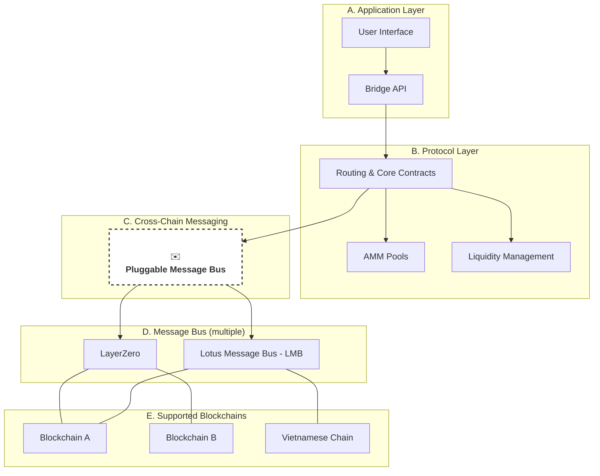
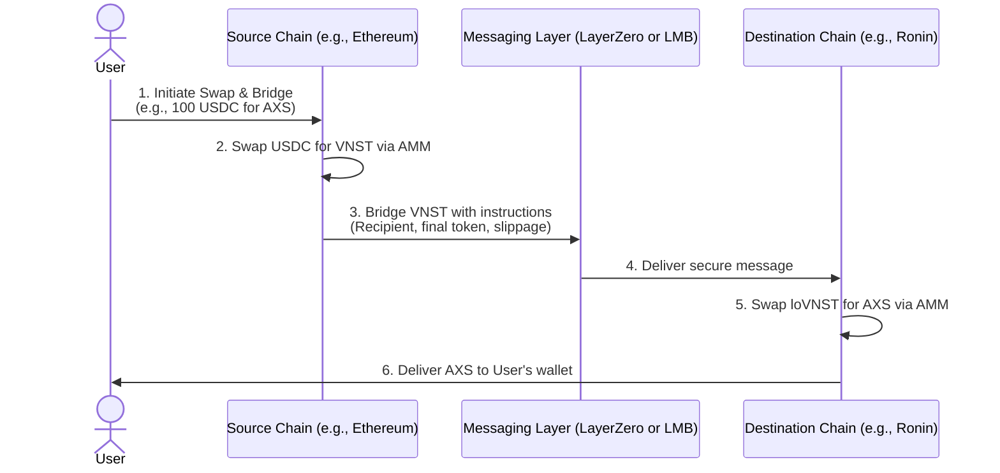
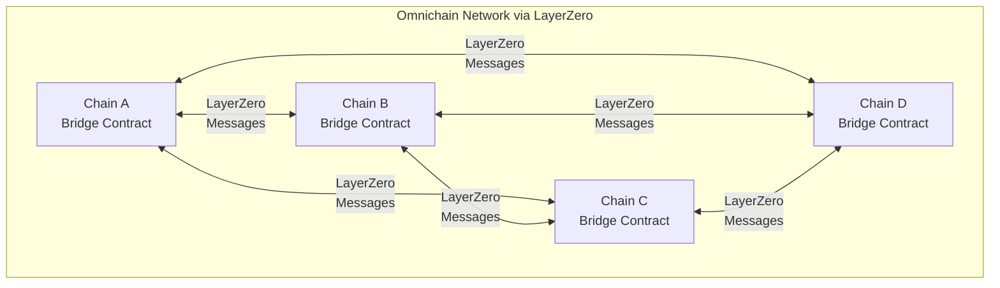
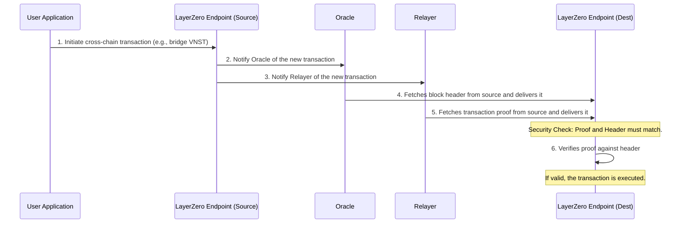
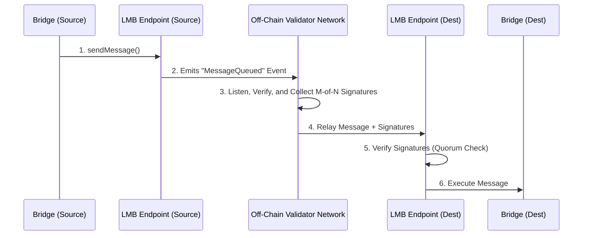
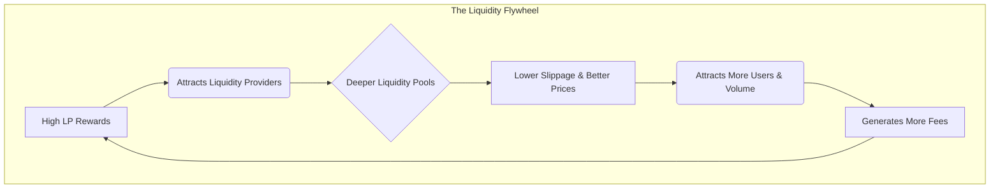
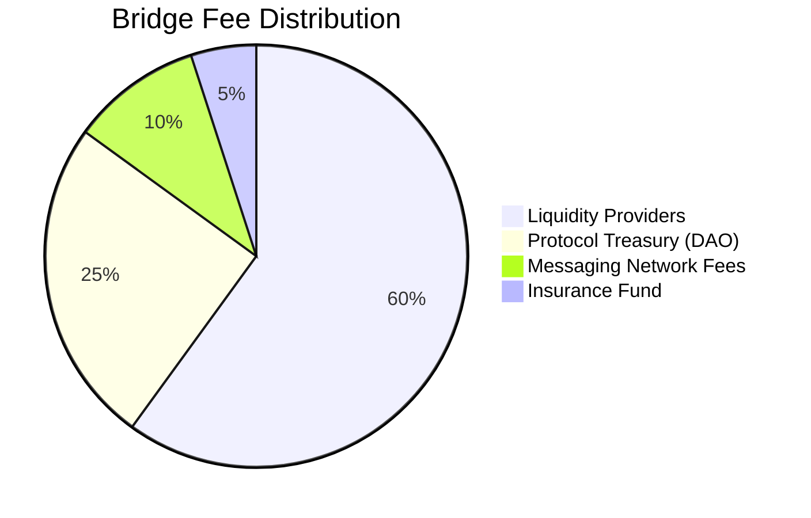
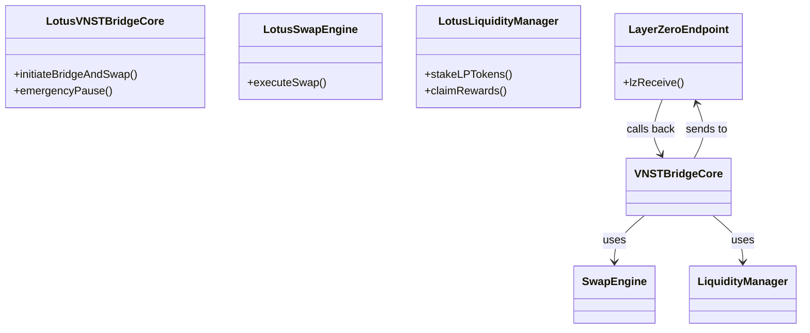

# Lotus Bridge: Technical Architecture

_Omnichain Liquidity Bridging and Messaging Protocol_

**Version:** 0.1
**Status:** Living Document (constantly updated to reflect the most up-to-date protocol technical changes)
**Last Updated:** June 28, 2025

---

## Table of Contents

1.  [Introduction](#1-introduction)
    - [1.1. The Vision: Vietnam's Gateway to the Interchain](#11-the-vision-vietnams-gateway-to-the-interchain)
    - [1.2. Executive Summary](#12-executive-summary)
    - [1.3. Target Audience](#13-target-audience)
2.  [System Architecture](#2-system-architecture)
3.  [The Core Engine: Intelligent Routing & Hybrid Bridging](#the-core-engine-intelligent-routing--hybrid-bridging)
4.  [Core Components](#core-components)
5.  [LayerZero Integration](#layerzero-integration)
    - [The Lotus Message Bus: A Sovereign Communication Layer](#the-lotus-message-bus-a-sovereign-communication-layer)
6.  [Automated Market Maker (AMM) Integration](#automated-market-maker-amm-integration)
    - [User Price Protection & Slippage Control](#user-price-protection--slippage-control)
7.  [Economic Model & Sustainability](#6-economic-model--sustainability)
    - [6.1. The Liquidity Flywheel: A Three-Pillar Approach](#61-the-liquidity-flywheel-a-three-pillar-approach)
    - [6.2. Fee Structure & Value Accrual](#62-fee-structure--value-accrual)
8.  [Our North Star: Cultivating Vietnam's DeFi Renaissance](#our-north-star-cultivating-vietnams-defi-renaissance)
9.  [Smart Contract Architecture](#smart-contract-architecture)
10. [Security Considerations](#security-considerations)
11. [Deployment Strategy](#deployment-strategy)

---

## 1. Introduction

### 1.1. The Vision: Vietnam's Gateway to the Interchain

The future of the digital economy is multichain. However, this fragmented landscape creates significant barriers for users and developers, isolating liquidity and stifling innovation. This is particularly true for emerging ecosystems.

**Lotus Bridge** is engineered to solve this. Our vision is to build the foundational liquidity and data messaging layer for Southeast Asia, starting with Vietnam. We are not just creating a tool to move assets; we are building a decentralized gateway that empowers the next generation of Vietnamese dApps, developers, and users to thrive in an interconnected blockchain universe. By providing seamless, secure, and economically-advantaged interoperability, we aim to establish Vietnam as a first-class citizen in the global DeFi landscape.

### 1.2. Executive Summary

Lotus Bridge is a sophisticated cross-chain protocol designed for seamless token bridging and swapping. It addresses the core challenges of interoperability by leveraging a hybrid architecture that combines a universal medium token (`VNST`), advanced AMMs (Uniswap V3), and a dual-pronged messaging system featuring both the battle-tested LayerZero protocol and a sovereign **Lotus Message Bus (LMB)** for emerging chains.

This design allows us to offer a one-click user experience that abstracts away all underlying complexity, while providing specialized, low-fee support for the Vietnamese DeFi ecosystem. The protocol is underpinned by a robust economic model designed to attract deep liquidity and ensure long-term, self-sustaining growth.

### 1.3. Target Audience

This document is intended for:

- **Internal Engineering Teams**: To serve as the primary technical blueprint for development, ensuring alignment and a shared understanding of the architecture.
- **External Developers & Potential Contributors**: To provide a clear overview of the protocol's design, encouraging integration and community contributions.
- **Investors & Stakeholders**: To articulate the technical vision, strategic differentiators, and long-term value proposition of the Lotus Bridge protocol.

---

## 2. System Architecture

The protocol is designed with a clean separation of concerns, organized into three distinct layers that work in concert to deliver its core functionality.



### High-Level Transaction Flow

From the user's perspective, a cross-chain swap is a single, atomic transaction. The protocol intelligently handles the complex sequence of events behind the scenes.



---

## The Core Engine: Intelligent Routing & Hybrid Bridging

The protocol's core innovation is a sophisticated engine that abstracts away the complexities of cross-chain transactions. For the user, every action is a single click. This engine is composed of two main parts: the **Intelligent Router**, which decides the most efficient path, and the **Hybrid Bridge**, which provides the mechanisms to execute the transfer.

### Part 1: The Intelligent Transaction Router

The router is the "brain" of the system. It analyzes the user's request (input token, output token, source chain, destination chain) and automatically determines the optimal execution path. This eliminates unnecessary steps, saving the user time and fees.

Here are the primary flows the router can select:

1.  **Full Bridge & Swap (e.g., USDC on Chain A → `loETH` on Chain B)**
    This is the most comprehensive flow, involving three steps:

    - **Source Swap**: The user's USDC is swapped for native VNST.
    - **Bridge**: The VNST is bridged to the destination chain, becoming `loVNST`.
    - **Destination Swap**: The `loVNST` is swapped for `loETH`, which is delivered to the user.

2.  **Direct Bridge (e.g., USDC on Chain A → `loUSDC` on Chain B)**
    If the user is bridging the same asset, swaps are unnecessary. The protocol optimizes by directly bridging the token.

    - **Bridge**: The user's USDC is locked/burned on the source chain, and a corresponding `loUSDC` is minted on the destination chain.
    - **No Swaps**: This avoids unnecessary fees and slippage.

3.  **Partial Swap (e.g., VNST on Chain A → `loETH` on Chain B)**
    When the user's input token is already the medium token, the source swap is skipped.

    - **Bridge**: The user's native VNST is bridged directly.
    - **Destination Swap**: The resulting `loVNST` is swapped for `loETH`.

4.  **Partial Swap (e.g., USDC on Chain A → `loVNST` on Chain B)**
    Conversely, if the user's desired output is the medium token, the destination swap is skipped.
    - **Source Swap**: The user's USDC is swapped for native VNST.
    - **Bridge**: The VNST is bridged and delivered to the user as `loVNST`.

### Part 2: The Hybrid Bridge Execution Layer

Once the router has chosen a path, the execution layer uses a combination of token standards and liquidity models to perform the bridge. This hybrid approach ensures scalability, capital efficiency, and a seamless user experience.

#### A. Omnichain Token Standards (The "How")

To handle cross-chain transfers efficiently, the protocol uses two distinct LayerZero-based mechanisms for making tokens "aware" of other chains.

- **OFT Standard for the Medium Token (VNST)**: For our core medium token, `VNST`, we use LayerZero's **Omnichain Fungible Token (OFT)** standard. This makes `VNST` itself an inherently cross-chain asset, allowing it to be seamlessly teleported between chains. The `loVNST` token on destination chains _is_ the OFT contract, which mints and burns tokens based on secure messages.

- **Universal Bridge for All Other Tokens**: Deploying an OFT contract for every token is not scalable. For all other assets (e.g., USDC, WETH), we use a single, powerful **`Bridge` contract** on each chain. This contract acts as a universal lockbox, locking tokens on the source chain and sending a generic message to the destination `Bridge` to mint a wrapped `loToken` equivalent. This allows us to support new tokens without deploying new infrastructure.

#### B. Liquidity Models (The "Source")

The bridge must source its tokens from somewhere. The protocol dynamically chooses between two models based on the route's volume and maturity.

- **Mint/Burn Mechanism (Default)**: This is the primary, most capital-efficient model. It locks tokens on the source chain and mints an equivalent wrapped `loToken` on the destination chain. It is infinitely scalable and requires no pre-seeded liquidity, making it perfect for launching new routes or supporting long-tail assets.

- **Liquidity Pool Mechanism (For High-Volume Routes)**: For major corridors (e.g., ETH-USDC), the protocol can also use traditional liquidity pools. A user's deposit on the source chain is matched with a withdrawal from a pool on the destination chain. This allows users to receive a native asset (e.g., native USDC instead of `loUSDC`), which can be a better user experience, but it requires significant upfront capital to fund the pools.

By combining intelligent routing with this hybrid execution layer, the protocol offers a system that is simultaneously powerful, flexible, and simple for the end-user.

---

## Core Components

### 1. The Medium Token: VNST (Intermediary Token To Support Cross-chain Swapping)

The protocol's foundation is the use of a single, stable medium token, **VNST**, for all cross-chain operations. This design choice is strategic:

- **Simplified Liquidity**: Instead of needing pools for every token pair (e.g., A-B, A-C, B-C), we only need pools for each token against VNST (A-VNST, B-VNST, C-VNST). This dramatically reduces the amount of liquidity required.
- **Stable Value**: Using a stablecoin minimizes the price volatility risk for users during the bridging process.

To function across multiple chains, VNST exists in two forms:

- **Native VNST**: The official VNST token on its origin chain (e.g., Ethereum).
- **Lotus VNST (loVNST)**: A synthetic, platform-branded version of VNST deployed on other chains. This token is created using a strict 1:1 backing mechanism, where each `loVNST` is backed by one native VNST locked in the bridge contract on the origin chain.

### 2. Cross-Chain State Consistency

The protocol does not attempt to replicate the entire state across all chains. Instead, it uses LayerZero messages to pass instructions and validate state changes. The core principle is that the total supply of circulating `loVNST` across all chains can never exceed the total amount of native VNST locked in the main bridge contract. This ensures the system remains solvent and fully backed at all times.

LayerZero enables omnichain functionality by allowing each chain to communicate with every other supported chain through secure message passing. This creates a network where state changes can be propagated and validated across multiple blockchains simultaneously.



---

## LayerZero Integration

### Security Model

The protocol's cross-chain security relies on LayerZero. LayerZero's security comes from the separation of duties between two independent off-chain entities: the **Oracle** and the **Relayer**.

- The Oracle forwards a block header from the source chain to the destination chain.
- The Relayer forwards the proof of the transaction itself.

The transaction is only considered valid if both the block header from the Oracle and the transaction proof from the Relayer match. This makes it extremely difficult for any single party to maliciously forge a cross-chain message.



While LayerZero provides a robust and secure foundation for mainstream chains, our vision of deeply cultivating the Vietnamese DeFi ecosystem requires a more tailored approach. Many promising Vietnamese blockchains are still in their nascent stages and not yet integrated into large-scale messaging infrastructures. To leave them disconnected would be a disservice to our mission.

This is why we are architecting the **Lotus Message Bus (LMB)**: a sovereign, extensible, and secure communication layer designed by us, for us.

### The Lotus Message Bus: A Sovereign Communication Layer

The LMB is not intended to reinvent the wheel or replace LayerZero across the board. Instead, it is a strategic piece of infrastructure that will run in parallel, giving us the unique ability to:

1.  **Onboard Emerging Vietnamese Chains**: Provide immediate cross-chain support for new blockchains that are not yet on LayerZero's roadmap.
2.  **Implement Custom Logic**: Introduce specialized validation, fee models, or processing logic tailored to the unique needs of our partners and the Vietnamese market.
3.  **Ensure Long-Term Sovereignty**: Reduce our dependence on a single provider and maintain control over our protocol's destiny and core functionality.

#### Modular by Design: The Swappable Messaging Layer

A critical architectural decision from the outset was to abstract the messaging layer. Our core bridge contracts are not hard-coded to LayerZero. Instead, they are built against a generic `IMessageBus` interface.

```solidity
interface IMessageBus {
    function sendMessage(
        uint16 destinationChainId,
        bytes calldata message,
        bytes calldata params
    ) external payable;
}
```

This means the messaging provider is a "pluggable" module. For any given transaction, our routing engine can decide whether to use LayerZero or the Lotus Message Bus based on the destination chain. This allows us to adopt the `LMB` incrementally without any changes to the application layer—the user experience remains seamless, and the core contracts remain unchanged.

#### LMB High-Level Architecture

The LMB consists of two primary components, operating in a trusted, proof-of-authority model initially, with a path towards greater decentralization.

1.  **On-Chain Endpoints**: Lightweight smart contracts deployed on each supported chain. Their role is simple:

    - **Source Chain**: Receive a message from our bridge contract and emit it as a secure, logged event.
    - **Destination Chain**: Hold a list of trusted validator addresses. It will only accept and execute a message if it is delivered by a sufficient quorum of registered validators.

2.  **Off-Chain Validator Network**: This is the heart of the LMB. It is a network of permissioned nodes that we operate. Their sole responsibility is to:
    - **Listen**: Continuously monitor the `Endpoint` contract events on all supported chains.
    - **Verify & Sign**: Upon detecting a new message event, each validator independently retrieves the transaction details, verifies its legitimacy, and signs the message payload with its private key.
    - **Relay**: Once a sufficient number of signatures (`M-of-N`) have been collected for a given message, one of the validators broadcasts the message and the collected signatures to the `Endpoint` contract on the destination chain.



#### The Path Forward

The Lotus Message Bus is currently in the design and early prototyping phase. Our default, battle-tested relayer for all major chains remains LayerZero. The LMB will be rolled out carefully, first on testnets and then for specific, strategic routes involving our Vietnamese blockchain partners.

This dual-pronged approach gives us the best of both worlds: the proven security and scale of a global leader, and the strategic flexibility and sovereignty of our own custom-built solution. It is a technical manifestation of our core vision: to build a bridge that not only connects worlds but also elevates our own.

---

## Automated Market Maker (AMM) Integration

To facilitate the swap part of the "bridge and swap" feature, the protocol integrates with AMMs on each chain. We have chosen to build upon the **Uniswap V3** model for its capital efficiency and advanced features.

- **Concentrated Liquidity**: Unlike Uniswap V2, which distributes liquidity evenly across all possible prices, Uniswap V3 allows Liquidity Providers to "concentrate" their capital within specific price ranges. This results in significantly deeper liquidity for the most common trading pairs, leading to lower slippage for most swaps.
- **Swap Routing**: The bridge contract will interact directly with the Uniswap V3 router to execute swaps. It will find the optimal path to convert the user's input token to `loVNST` and vice-versa.
- **Price Oracles**: To protect against price manipulation (e.g., via flash loans), our system will consult Uniswap V3's built-in Time-Weighted Average Price (TWAP) oracles. These are highly robust and provide a reliable on-chain price feed that is resistant to short-term manipulation.

### User Price Protection & Slippage Control

The price of an asset in an AMM pool is a direct function of the token balances in that pool. Since the pools on Chain A and Chain B are independent, their prices can and will diverge. A user might initiate a swap expecting a certain price, only to find that the market on the destination chain has moved against them by the time the bridge message arrives.

Our protocol is designed with several layers of protection to mitigate this problem and ensure a predictable and fair user experience.

#### 1. Pre-Transaction Quoting & Guaranteed Output

Before a user confirms any transactilon, the user interface wil provide a firm quote. This is not just an estimate based on the source chain; it's a calculated price that accounts for the entire transaction path:

1.  **Source Swap Simulation**: The protocol simulates the initial swap on the source chain (e.g., USDC to VNST).
2.  **Destination Swap Simulation**: Crucially, our relayer service simultaneously queries the state of the destination AMM pool (e.g., `loVNST`/`loETH` on the destination chain) to get the current price.
3.  **Combined Quote**: The UI presents the user with a clear "You send X, you receive Y" quote, factoring in both swaps and all associated fees.

#### 2. User-Defined Slippage Control

A quote is only valid for a moment in time. To protect against price changes while the transaction is in flight (i.e., being bridged), the user can set a **maximum slippage tolerance**.

- **How it works**: The user's desired minimum output amount (based on their slippage setting) is encoded into the LayerZero message sent to the destination chain.
- **On-Chain Enforcement**: The smart contract on the destination chain will perform the final swap _only if_ it can meet or exceed this minimum output amount. If the price has moved unfavorably beyond the user's tolerance, the entire transaction reverts, and the funds are returned to the user on the source chain (minus gas fees). This prevents "bad surprises" and gives users full control.

#### 3. Robust Price Oracles (Uniswap V3 TWAP)

To generate reliable quotes and prevent price manipulation, the protocol does not rely on the instantaneous "spot price" of an AMM pool, which can be easily manipulated by a flash loan. Instead, we leverage **Uniswap V3's built-in Time-Weighted Average Price (TWAP) oracles**.

- **Manipulation Resistance**: TWAP provides an average price over a period of time, making it far more resilient to short-term price manipulation.
- **Reliable Quotes**: This ensures that the quotes we provide to users are based on a more stable and trustworthy price feed, reducing the risk of failed transactions due to temporary price spikes.

By combining pre-transaction quoting, user-defined slippage control, and robust TWAP oracles, the protocol abstracts away the complexity and risk of cross-chain price differences, delivering on the promise of a seamless and secure swap experience.

---

## 6. Economic Model & Sustainability

A cross-chain protocol is only as powerful as the liquidity within its AMM pools. This section outlines the economic engine designed to solve this critical liquidity bootstrapping problem and ensure the long-term sustainability of the Lotus Bridge ecosystem.

The strategy is to create a self-reinforcing **Liquidity Flywheel**, making it highly profitable for third-party Liquidity Providers (LPs) to deposit their assets into the protocol's AMM pools.

### 6.1. The Liquidity Flywheel: A Three-Pillar Approach

#### Pillar 1: Protocol-Owned Liquidity (Seeding the Engine)

The journey begins with the protocol's treasury providing the initial, baseline liquidity for key pairs (e.g., `loVNST`/`USDC`, `loVNST`/`loETH`) on a new chain. This is often called "Protocol-Owned Liquidity" (POL). It ensures the bridge is functional from day one, but it is only the first step.

#### Pillar 2: Liquidity Mining (The Core Incentive)

To attract community capital at scale, we will implement a robust liquidity mining program. LPs who stake their AMM LP tokens in our protocol's staking contracts will earn rewards from multiple sources simultaneously:

- **Trading Fees**: LPs automatically earn a percentage of the fees from every swap that happens in their pool (e.g., 0.25% of a 0.30% fee).
- **Bridge Fees**: A significant portion of the fees generated by the bridge protocol itself is distributed back to the LPs. This directly aligns their incentives with the success and volume of the bridge.
- **Emission Rewards (Yield Farming)**: The protocol will have a native governance token (e.g., `$LOTUS`). A portion of these tokens are distributed ("emitted") to LPs as a direct reward for their participation. This is often the most powerful incentive for attracting and retaining liquidity.

#### Pillar 3: The Flywheel Effect

These incentives create a virtuous cycle:

1.  **High Rewards Attract LPs**: The combined yield from fees and emissions makes providing liquidity highly attractive.
2.  **Deeper Liquidity**: More LPs lead to deeper liquidity in the AMM pools.
3.  **Better User Experience**: Deeper liquidity results in lower price slippage and better execution for users swapping and bridging tokens.
4.  **Increased Volume**: A better user experience attracts more users and higher transaction volume.
5.  **Higher Fee Revenue**: More volume generates more trading and bridge fees, which in turn increases the rewards for LPs, making the proposition even more attractive.

This flywheel is the core of the protocol's long-term growth and sustainability strategy.



### 6.2. Fee Structure & Value Accrual

The protocol generates revenue through a small, dynamic fee on each bridge transaction. This fee is a critical component of the flywheel, designed to be competitive for users while sustainably funding the ecosystem.

#### Fee Distribution

The collected fees are distributed programmatically to four key areas:



- **Liquidity Providers (60%)**: The majority of revenue is returned to the LPs who make the protocol possible. This is the primary driver of the liquidity flywheel.
- **Protocol Treasury (25%)**: Funds the ongoing development, operational costs, and strategic initiatives of the protocol. This will eventually be managed by a community-governed DAO.
- **Messaging Network Fees (10%)**: Covers the operational costs of the underlying cross-chain messaging layer (e.g., LayerZero gas fees, LMB validator incentives).
- **Insurance Fund (5%)**: A protocol-owned fund that can be deployed to protect users in the unlikely event of a contract exploit or economic failure. This builds trust and resilience.

---

### Our North Star: Cultivating Vietnam's DeFi Renaissance

From day one, our mission has extended far beyond simply moving assets between chains. As a team with deep roots in Vietnam, we are driven by a profound commitment to empower our home-grown digital economy. We see the immense talent, the vibrant communities, and the untapped potential within the Vietnamese blockchain space. Lotus Bridge is our answer to the question: "How can we build a foundational platform that not only serves but actively accelerates the growth of a domestic DeFi ecosystem?"

This is not a marketing afterthought; it is a core design principle embedded into the protocol's architecture. We are architecting a system that deliberately creates a center of gravity for Vietnamese innovation, ensuring that local projects and users have a competitive edge on the global stage.

#### The "Vietnamese Priority Lane": A Technical Commitment

To transform this vision into reality, we have engineered a "Vietnamese Priority Lane" directly into our protocol. This is a set of special, technically-enforced features reserved for tokens that are foundational to the Vietnamese market, such as **VNST, VNDC, C98, AXS, SLP, KAI, RON**, and other upcoming projects.

This is how we provide a tangible advantage:

1.  **Economically Advantaged Transactions (Fee Reduction)**: Transactions involving designated Vietnamese tokens receive a substantial, hard-coded discount on protocol fees—up to 50%. From a technical standpoint, our fee module identifies these token addresses and applies a different fee tier. This directly lowers the barrier to entry for users, increases the capital efficiency of interacting with local dApps, and makes Vietnamese tokens more attractive to trade and hold across our entire supported network of chains.

2.  **Prioritized & Accelerated Processing (Faster Finality)**: In the competitive world of DeFi, speed is critical. Our off-chain relayer network is engineered with a priority queue. Messages and transactions related to the Vietnamese Priority Lane are flagged and processed with precedence. This ensures that swaps and bridges for these tokens achieve faster finality, providing a superior, smoother user experience and a crucial advantage for time-sensitive operations.

3.  **Seamless Integration & Ecosystem Support**: We are committed to being more than just a service provider; we are a partner. We offer dedicated technical support, streamlined documentation, and direct access to our engineering team to help Vietnamese projects integrate with our bridge. This reduces their development overhead and time-to-market, allowing them to focus on their core innovation.

By embedding these advantages at the protocol level, we aim to create a powerful, self-reinforcing cycle: increased support for Vietnamese tokens leads to greater liquidity and adoption, which in turn attracts more users and developers to the ecosystem. Lotus Bridge is designed to be the engine of this growth, a piece of critical infrastructure built by Vietnam, for Vietnam's future in decentralized finance.

---

## High-level Smart Contract Architecture

The contract architecture is designed to be modular and upgradable.

- **Separation of Concerns**: The logic is split into distinct contracts. For example, a `SwapEngine` handles all AMM interactions, a `LiquidityManager` handles LP staking, and the main `Bridge` contract orchestrates the overall flow. This makes the system easier to audit and upgrade.
- **Upgradability**: The core contracts will use the UUPS (Universal Upgradeable Proxy Standard) pattern. This allows the contract logic to be upgraded without requiring users to migrate their funds, ensuring smooth evolution of the protocol.
- **Security**: All contracts will inherit standard security modules from providers like OpenZeppelin, including re-entrancy guards, pausable functionality, and robust access control.



---

## Security Considerations

Security is paramount. Our strategy is multi-layered:

- **Smart Contract Security**: The codebase will undergo multiple independent audits. We will also run a public bug bounty program.
- **LayerZero Security**: We inherit the security of the underlying LayerZero protocol.
- **Economic Security**: The protocol includes circuit breakers to halt activity in case of unusual volume or price movements. For example, there will be limits on the maximum transaction size and the total value that can be bridged in a 24-hour period.
- **Operational Security**: Protocol administration functions will be controlled by a multi-signature wallet with a time-lock. This prevents any single person from making critical changes and provides time for the community to react to proposed upgrades.

---

## Deployment Strategy

The protocol will be rolled out in phases to ensure stability and security.

1.  **Testnet Phase**: Initial deployment on testnets (e.g., Ethereum Sepolia, Base Sepolia) for public testing and feedback.
2.  **Mainnet Launch (Guarded)**: Launch on Ethereum and Base with conservative limits on bridge volume. The initial liquidity will be seeded by the team.
3.  **Expansion Phase**: Gradually add support for more chains (Polygon, Arbitrum, etc.) and increase the volume limits as the protocol proves its stability.
4.  **Decentralization**: Transition control of the protocol parameters and treasury to a community-governed DAO.
