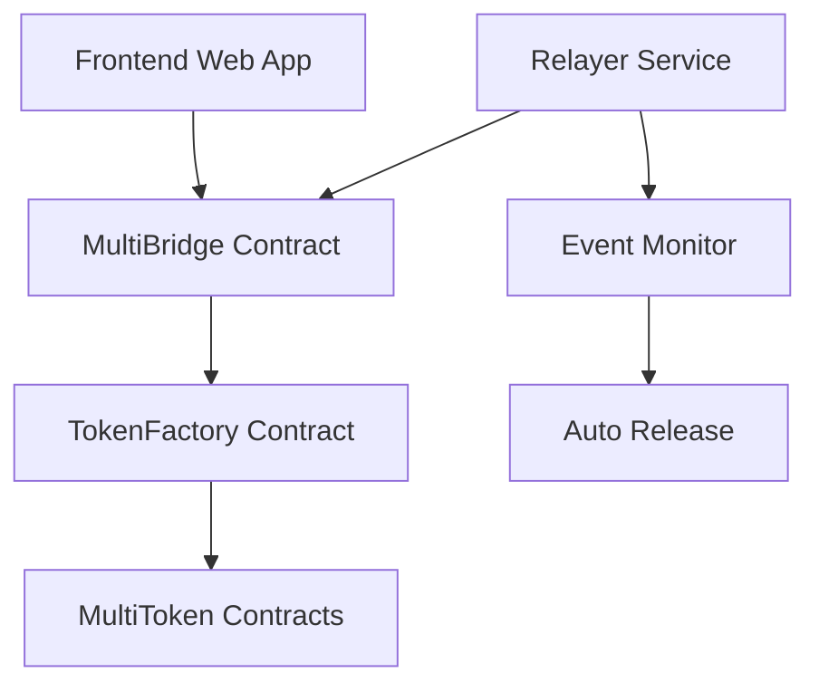

# 🌉 Multi-Token Cross-Chain Bridge

> **Secure and automated multi-token transfers between Ethereum Sepolia and Base Sepolia**

   

## 🎯 Overview

A decentralized bridge system enabling seamless ERC-20 token transfers between Ethereum Sepolia and Base Sepolia. Supports **9 different tokens** with user-friendly interface and automated relayer service.

### 🪙 Supported Tokens
- **AXS** - Axie Infinity Shard
- **SLP** - Smooth Love Potion  
- **VNST** - VN Stable
- **VNDC** - VN Digital Coin
- **A8** - A8 Token
- **SIPHER** - Sipher Token
- **C98** - Coin98
- **KNC** - Kyber Network Crystal
- **KAI** - KardiaChain

---

## 🏗️ Architecture



### 📦 Components

- **TokenFactory.sol** - Manages and deploys all tokens
- **MultiBridge.sol** - Handles multi-token bridge logic
- **MultiToken.sol** - ERC-20 template for all tokens
- **Frontend** - Web interface with MetaMask integration
- **Relayer** - Automated token release service

---

## 🚀 Quick Start

```bash
# Clone and setup
git clone <repository-url>
cd bridge-web
npm install
cd relayer && npm install

# Start relayer
npm run relayer:start

# Open frontend
open frontend/index.html
```

### 📋 Requirements

- Node.js >= 16.0.0
- MetaMask extension
- Sepolia/Base Sepolia testnet ETH

---

## 🔧 Setup

### 1. Environment Configuration

Create `.env` file:

```env
# Network RPCs
SEPOLIA_RPC_URL=https://eth-sepolia.public.blastapi.io
BASE_SEPOLIA_RPC_URL=https://sepolia.base.org

# Contract Addresses (update after deployment)
SEPOLIA_MULTI_BRIDGE=0x88A6B192D1349a686E088f428cF7E0037Ea775b0
BASE_SEPOLIA_MULTI_BRIDGE=0xad1eE286bd3e9682Dc0E21b91A00E575404505a2

# Private Keys (for relayer auto-release)
SEPOLIA_PRIVATE_KEY=your_sepolia_private_key
BASE_SEPOLIA_PRIVATE_KEY=your_base_sepolia_private_key
```

### 2. Deploy Contracts

```bash
# Deploy on Sepolia
npx hardhat run scripts/deployMultiToken.ts --network sepolia

# Deploy on Base Sepolia  
npx hardhat run scripts/deployMultiToken.ts --network baseSepolia

# Update addresses in .env and frontend/bridge.js
```

### 3. Start Services

```bash
# Start relayer (required for auto-release)
cd relayer && npm start

# Serve frontend
npm run serve
```

---

## 💡 Usage

### 🌐 Bridge Tokens

1. **Connect Wallet** - MetaMask auto-detection
2. **Select Token** - Choose from 9 available tokens
3. **Set Amount** - Enter amount and recipient address
4. **Execute** - Approve tokens → Bridge tokens
5. **Auto-Release** - Relayer completes transfer automatically

### 🤖 Relayer Process

The relayer monitors bridge events 24/7 and automatically releases tokens:

```
🔒 TokensLocked detected on Sepolia
🚀 Auto-releasing AXS tokens on Base Sepolia...
✅ Tokens released successfully!
```

---

## 📊 API

### Relayer Endpoints

```bash
# System status
GET http://localhost:3001/api/status

# Supported tokens
GET http://localhost:3001/api/tokens/11155111  # Sepolia
GET http://localhost:3001/api/tokens/84532     # Base Sepolia

# Manual release (backup)
POST http://localhost:3001/api/release
{
  "recipient": "0x...",
  "amount": "1000", 
  "tokenSymbol": "AXS",
  "sourceChain": "11155111",
  "targetChain": "84532",
  "transactionId": "0x..."
}
```

### Smart Contract Methods

```solidity
// Bridge tokens
function bridgeTokens(
    string tokenSymbol,
    address recipient,
    uint256 amount, 
    uint256 targetChain
) external;

// Get fee estimate
function estimateFee(uint256 amount) external view returns (uint256);

// Get token address
function getTokenAddress(string tokenSymbol) external view returns (address);
```

---

## ✨ Features

### Frontend
- [x] Modern responsive UI/UX
- [x] Real-time balance updates
- [x] Automatic fee estimation
- [x] Transaction history tracking
- [x] Multi-network support

### Backend
- [x] 24/7 event monitoring
- [x] Auto-release (< 30 seconds)
- [x] Comprehensive logging
- [x] Security validations
- [x] Transaction deduplication

### Security
- [x] Owner-only permissions
- [x] Reentrancy protection
- [x] Double-spending prevention
- [x] Input validation

---

## 🔍 Troubleshooting

**Token balance shows 0?**
- Check if tokens were transferred to your account
- Verify correct network (Sepolia vs Base Sepolia)
- Update contract addresses if needed

**Relayer not auto-releasing?**
- Verify private keys in .env
- Ensure sufficient ETH for gas
- Check owner permissions

**Bridge transaction failed?**
- Complete token approval first
- Verify sufficient balance (including fees)
- Confirm target chain support

---

## 🛠️ Development

```bash
# Run tests
npx hardhat test

# Compile contracts
npx hardhat compile

# Local development
npm run dev:all
```

---

## 📄 License

MIT License - see LICENSE file for details.

---

## 🤝 Contributing

1. Fork the repository
2. Create feature branch (`git checkout -b feature/amazing-feature`)
3. Commit changes (`git commit -m 'Add amazing feature'`)
4. Push to branch (`git push origin feature/amazing-feature`)
5. Open Pull Request

---

<div align="center">

**🌉 Connecting blockchains, one token at a time**

Made with ❤️ for the DeFi community

</div>